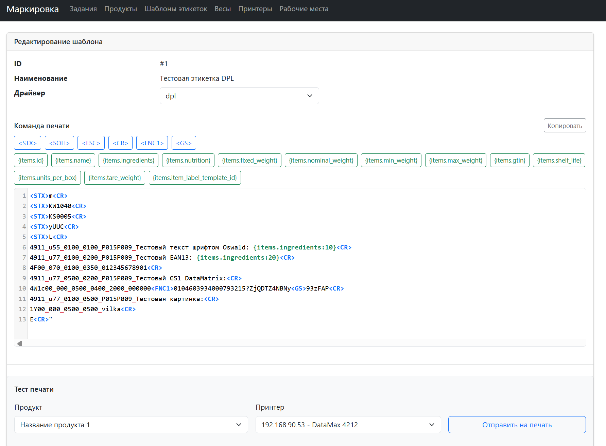
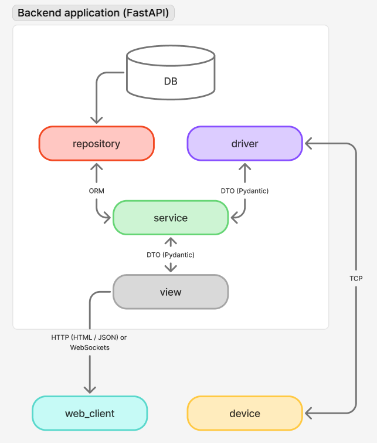

О приложении
======
Приложение реализует маркировку весовых товаров. 

Приложение предоставляет пользовательский интерфейс, а также API для ввода новых товаров и заданий на маркировку. 

Приложение реализует коммуникацию с оборудованием - с весами для получения веса и принтерами для печати этикеток.

Функционал в разрезе модулей
======
* Весы (scales) - получение веса по запросу и в потоке
* Принтеры этикеток (printers) - отправка этикетки на печать, загрузка шрифта, загрузка картинок
* Шаблоны этикеток (labels) - редактирование в текстовом UI, тестовая печать
* Рабочие места (workplaces) - модуль в разработке
* Товары (items) - модуль в разработке
* Маркировка по заданиям (transactions) - модуль в разработке

<p align="center">
    
</p>

Стек
======
* Python 3.12
* Бэкенд - FastAPI, SQLAlchemy, Alembic, Pydantic
* Фронтенд - Jinja2, Bootstrap + вайб-код JS

Архитектура приложения
======
<p align="center">
    
</p>

Установка
======
Локальная установка
------
1. Создайте и активируйте виртуальное окружение
```shell
python3.12 -m venv venv
. venv/bin/activate
```
2. Установите зависимости
```shell
pip install -r requirements.txt 
```
3. Заполните файл с переменными окружения `infra/.env` используя пример `.env.example`
4. Создайте БД PostgreSQL с данными из `infra/.env`
5. Примените миграции
```shell
alembic upgrade head
```
6. Перейдите в базовую директорию проекта
```shell
cd src/
```
7. (фикстуры, создание первого админа - к доработке)
8. Запустите проект
```shell
python main.py
```

Драйверы устройств
======
Драйверы весов
------
Настроенные драйверы весов: 
1. Тензо-М - совместим с терминалом ТВ-020
2. Mettler-Toledo MTSics Level 1 - совместим с терминалом IND226
3. DIGI - совместим с терминалом DI160 (работает в потоке)

Реализован симулятор весов Тензо-М:

1. Запустите сервер в первом терминале.
2. Создайте в приложении весы, укажите ip-адрес и порт
3. В файле `src/device_drivers/scales/simulator.py` заполните ip-адрес и порт созданных в приложении весов, укажите диапазон веса для генерации случайных значений. 
4. Запустите `simulator.py` во втором терминале командой `python -m device_drivers.scales.simulator`
5. Весы будут бесконечно отвечать на запросы. Текст запроса не обрабатывается, на любую команду симулятор отвечает случайным значением веса. 

Драйверы принтеров этикеток
------
Настроенные драйверы принтеров:
1. Язык DPL - совместим с Datamax I-4212e
2. Язык EZPL - совместим с GoDex zx1300Xi

Настроена обработка следующих команд для принтера этикеток:
1. Загрузка шрифта из ttf-файла. Шрифту нужно присвоить номер.
2. Загрузка картинки из jpg/png-файла. Имя файла используется загружается в файл как имя картинки.
3. Отправка команды печати этикетки. Основная команда

План развития
------
1. Аутентификация в веб-фронтенде и API
2. Рабочие места - CRUD через фронт
3. Задания на маркировку - CRUD через фронт и API
4. Основной функционал - исполнение задания с использованием всех подготовленных наработок. Основной режим "взвесил товар - получил этикетку" и иные режимы. 